<!-- Header -->

  

  
  
  
  
  
  

 

<!-- Snake Evolution -->

  

 

<kbd>▼ Show more... ▼</kbd>

  
 ## 📊 GitHub Stats

  <!--  -->
  
  

## 🛠️ Tech Stack

<!-- Stack badges -->

  <!-- 
    -->
    
    
    

 

<table style="width: auto; margin: 0 auto; border-collapse: collapse;">
  <tr>
    <td width="110" align="left"><strong>Languages:</strong></td>
    <td width="100%" align="right">
      
    </td>
  </tr>
  <tr>
    <td width="110" align="left"><strong>Mobile:</strong></td>
    <td width="100%" align="right">
      
    </td>
  </tr>
  <tr>
    <td width="110" align="left"><strong>Frontend:</strong></td>
    <td width="100%" align="right">
      
    </td>
  </tr>
  <tr>
    <td width="110" align="left"><strong>Backend:</strong></td>
    <td width="100%" align="right">
      
    </td>
  </tr>
  <tr>
    <td width="110" align="left"><strong>Desktop:</strong></td>
    <td width="100%" align="right">
      
    </td>
  </tr>
  <tr>
    <td width="110" align="left"><strong>State:</strong></td>
    <td width="100%" align="right">
      
    </td>
  </tr>
  <tr>
    <td width="110" align="left"><strong>API:</strong></td>
    <td width="100%" align="right">
      
    </td>
  </tr>
  <tr>
    <td width="110" align="left"><strong>BaaS:</strong></td>
    <td width="100%" align="right">
      
    </td>
  </tr>
  <tr>
    <td width="110" align="left"><strong>DB & ORM:</strong></td>
    <td width="100%" align="right">
      
    </td>
  </tr>
  <tr>
    <td width="110" align="left"><strong>DevOps:</strong></td>
    <td width="100%" align="right">
      
    </td>
  </tr>
  <tr>
    <td width="110" align="left"><strong>Testing:</strong></td>
    <td width="100%" align="right">
      
    </td>
  </tr>
  <tr>
    <td width="110" align="left"><strong>Monitoring:</strong></td>
    <td width="100%" align="right">
      
    </td>
  </tr>
  <tr>
    <td width="110" align="left"><strong>Dev Tools:</strong></td>
    <td width="100%" align="right">
      
    </td>
  </tr>
  <tr>
    <td width="110" align="left"><strong>Auth:</strong></td>
    <td width="100%" align="right">
      
    </td>
  </tr>
  <tr>
    <td width="110" align="left"><strong>Payments:</strong></td>
    <td width="100%" align="right">
      
    </td>
  </tr>
  <tr>
    <td width="110" align="left"><strong>CMS:</strong></td>
    <td width="100%" align="right">
      
    </td>
  </tr>
  <tr>
    <td width="110" align="left"><strong>AI & ML:</strong></td>
    <td width="100%" align="right">
      
    </td>
  </tr>
</table>

## 👨‍🎓 Education

### 🎓 2010 - 2014: Technical University of Liberec

- Faculty of Electrical Engineering and Computer Science
- Field of Information Technology
- Incomplete

### 🎓 2008 - 2010: Czech Technical University in Prague
  
- Faculty of Electrical Engineering
- Transferred to TUL

### 🎓 2004 - 2008: VOŠ and SPŠ Masarykova in Kutná Hora
  
- Field of Electrical Engineering
- Communication Technology

## 📚 Work Experience and Projects

### 💼 Freelancer (2019 - Present)

  <table style="width:100%; border-collapse:collapse;">
    <colgroup>
      <col style="width:260px;" />
      <col style="width:220px;" />
      <col style="width:140px;" />
      <col style="width:auto;" />
    </colgroup>
    <thead>
      <tr>
        <th align="center" style="border:none; padding:6px 0;">Project</th>
        <th align="center" style="border:none; padding:6px 0;">Client</th>
        <th align="center" style="border:none; padding:6px 0;">Duration</th>
        <th align="center" style="border:none; padding:6px 0;">Stack</th>
      </tr>
    </thead>
    <tbody>
      <tr>
        <td valign="middle" style="border:none; padding:6px 0;">
          <a href="https://spudnow.co.uk/">SPUD Now</a>
        </td>
        <td valign="middle" style="border:none; padding:6px 0;">
          DownloDev
        </td>
        <td valign="middle" style="border:none; padding:6px 0;">
          03/2023 – 08/2024
        </td>
        <td valign="middle" style="border:none; padding:6px 0;">
          
            
            
            
          
        </td>
      </tr>
      <tr>
        <td style="border:none; padding:6px 0;">
          <a href="https://www.tlappka.cz/">Tlappka</a>
        </td>
        <td style="border:none; padding:6px 0;">
          <a href="https://veevoy.com">Veevoy</a>
        </td>
        <td style="border:none; padding:6px 0;">2023</td>
        <td style="border:none; padding:6px 0;">
          
            
            
            
            
          
        </td>
      </tr>
      <tr>
        <td style="border:none; padding:6px 0;">
          <a href="https://www.union.sk/union-zp-aplikacia-na-mobile">Union</a>
        </td>
        <td style="border:none; padding:6px 0;">
          <a href="https://www.bootiq.io">BOOTIQ</a>
        </td>
        <td style="border:none; padding:6px 0;">03/2022 – 10/2022</td>
        <td style="border:none; padding:6px 0;">
          
            
            
            
            
            
          
        </td>
      </tr>
      <tr>
        <td style="border:none; padding:6px 0;">
          <a href="https://www.sabservis.cz/myplann">myPlann</a>
        </td>
        <td style="border:none; padding:6px 0;">
          <a href="https://www.sabservis.cz">SABService</a>
        </td>
        <td style="border:none; padding:6px 0;">2022</td>
        <td style="border:none; padding:6px 0;">
          
            
            
            
            
          
        </td>
      </tr>
      <tr>
        <td style="border:none; padding:6px 0;">
          <a href="https://www.mamio-app.com">Mamio</a>
        </td>
        <td style="border:none; padding:6px 0;">
          <a href="https://elias-itsolutions.sk">Eliaš IT Solutions</a>
        </td>
        <td style="border:none; padding:6px 0;">05/2021 – 12/2022</td>
        <td style="border:none; padding:6px 0;">
          
            
            
            
          
        </td>
      </tr>
      <tr>
        <td style="border:none; padding:6px 0;">
          <a href="https://www.ocearch.org/tracker/?">SharkTracker</a>
        </td>
        <td style="border:none; padding:6px 0;">
          <a href="https://www.mapotic.cz">Mapotic</a>
        </td>
        <td style="border:none; padding:6px 0;">2021</td>
        <td style="border:none; padding:6px 0;">
          
            
            
            
          
        </td>
      </tr>
      <tr>
        <td style="border:none; padding:6px 0;">
          Keys of the Treasure
        </td>
        <td style="border:none; padding:6px 0;">
          <a href="https://www.sundisk.cz/cs/">Sundisk</a>
        </td>
        <td style="border:none; padding:6px 0;">2019 – 2021</td>
        <td style="border:none; padding:6px 0;">
          
            
            
            
            
          
        </td>
      </tr>
    </tbody>
  </table>
  

### 💼 As4u.cz (2014 - 2018)

  

  <table style="width:100%; border-collapse:collapse;">
    <colgroup>
      <col style="width:280px;" />
      <col style="width:140px;" />
      <col style="width:auto;" />
    </colgroup>
    <thead>
      <tr>
        <th align="center" style="border:none; padding:6px 0;">Project</th>
        <th align="center" style="border:none; padding:6px 0;">Year</th>
        <th align="center" style="border:none; padding:6px 0;">Stack</th>
      </tr>
    </thead>
    <tbody>
      <tr>
        <td style="border:none; padding:6px 0;">Turnov v mobilu</td>
        <td style="border:none; padding:6px 0;">2015–2024</td>
        <td style="border:none; padding:6px 0;">
          
            
            
            
            
          
        </td>
      </tr>
      <tr>
        <td style="border:none; padding:6px 0;">Praha 11</td>
        <td style="border:none; padding:6px 0;">2016–2024</td>
        <td style="border:none; padding:6px 0;">
          
            
            
            
            
          
        </td>
      </tr>
      <tr>
        <td style="border:none; padding:6px 0;">Cestovatelský fotodeník</td>
        <td style="border:none; padding:6px 0;">2017–2023</td>
        <td style="border:none; padding:6px 0;">
          
            
            
          
        </td>
      </tr>
      <tr>
        <td style="border:none; padding:6px 0;">Vrbno v mobilu</td>
        <td style="border:none; padding:6px 0;">2018–2023</td>
        <td style="border:none; padding:6px 0;">
          
            
            
          
        </td>
      </tr>
      <tr>
        <td style="border:none; padding:6px 0;">Prostějov v mobilu</td>
        <td style="border:none; padding:6px 0;">2018–2023</td>
        <td style="border:none; padding:6px 0;">
          
            
            
          
        </td>
      </tr>
      <tr>
        <td style="border:none; padding:6px 0;">Jablonec v mobilu</td>
        <td style="border:none; padding:6px 0;">2014–2024</td>
        <td style="border:none; padding:6px 0;">
          
            
            
            
            
          
        </td>
      </tr>
      <tr>
        <td style="border:none; padding:6px 0;">Litovel v mobilu</td>
        <td style="border:none; padding:6px 0;">2016–2024</td>
        <td style="border:none; padding:6px 0;">
          
            
            
          
        </td>
      </tr>
      <tr>
        <td style="border:none; padding:6px 0;">Šumperk v mobilu</td>
        <td style="border:none; padding:6px 0;">2015–2023</td>
        <td style="border:none; padding:6px 0;">
          
            
            
          
        </td>
      </tr>
      <tr>
        <td style="border:none; padding:6px 0;">Jindřichův Hradec v mobilu</td>
        <td style="border:none; padding:6px 0;">2015–2023</td>
        <td style="border:none; padding:6px 0;">
          
            
            
            
          
        </td>
      </tr>
      <tr>
        <td style="border:none; padding:6px 0;">Kuřim v mobilu</td>
        <td style="border:none; padding:6px 0;">2014–2023</td>
        <td style="border:none; padding:6px 0;">
          
            
            
          
        </td>
      </tr>
      <tr>
        <td style="border:none; padding:6px 0;">Poznej Hradec</td>
        <td style="border:none; padding:6px 0;">2014–2023</td>
        <td style="border:none; padding:6px 0;">
          
            
            
          
        </td>
      </tr>
      <tr>
        <td style="border:none; padding:6px 0;">BITVA 1866</td>
        <td style="border:none; padding:6px 0;">2016–2023</td>
        <td style="border:none; padding:6px 0;">
          
            
          
        </td>
      </tr>
      <tr>
        <td style="border:none; padding:6px 0;">Dny Evropského Dědictví</td>
        <td style="border:none; padding:6px 0;">2018–2022</td>
        <td style="border:none; padding:6px 0;">
          
            
            
          
        </td>
      </tr>
      <tr>
        <td style="border:none; padding:6px 0;">Textilní a oděvní dílna</td>
        <td style="border:none; padding:6px 0;">2016</td>
        <td style="border:none; padding:6px 0;">
          
            
            
          
        </td>
      </tr>
      <tr>
        <td style="border:none; padding:6px 0;">Kojetín v mobilu</td>
        <td style="border:none; padding:6px 0;">2016–2020</td>
        <td style="border:none; padding:6px 0;">
          
            
            
          
        </td>
      </tr>
      <tr>
        <td style="border:none; padding:6px 0;">Týniště nad Orlicí</td>
        <td style="border:none; padding:6px 0;">2017–2020</td>
        <td style="border:none; padding:6px 0;">
          
            
            
          
        </td>
      </tr>
      <tr>
        <td style="border:none; padding:6px 0;">Český ráj</td>
        <td style="border:none; padding:6px 0;">2016–2020</td>
        <td style="border:none; padding:6px 0;">
          
            
            
          
        </td>
      </tr>
      <tr>
        <td style="border:none; padding:6px 0;">Český systém kvality služeb</td>
        <td style="border:none; padding:6px 0;">2015</td>
        <td style="border:none; padding:6px 0;">
          
            
            
          
        </td>
      </tr>
      <tr>
        <td style="border:none; padding:6px 0;">Mladoboleslavsko</td>
        <td style="border:none; padding:6px 0;">2015</td>
        <td style="border:none; padding:6px 0;">
          
            
            
            
          
        </td>
      </tr>
      <tr>
        <td style="border:none; padding:6px 0;">Průvodce Libereckým krajem</td>
        <td style="border:none; padding:6px 0;">2015</td>
        <td style="border:none; padding:6px 0;">
          
            
            
            
          
        </td>
      </tr>
    </tbody>
  </table>
  

 

  

---

  
  

