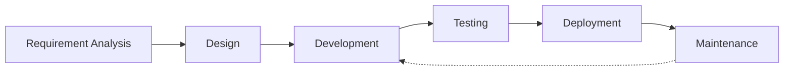

# Table of Contents

- 🔍 [Current Projects](#-current-projects)
  - 📱 [MMVM - Moje město v mobilu](#-mmvm---moje-město-v-mobilu)
  - 📱 [Zvono Pawnshop](#-zvono-pawnshop)
- 📚 [Work Experience & Projects](#-work-experience--projects)
  - 👨‍💻 [Freelancer (2019 - Present)](#-freelancer-2019---present)
  - 👨‍💻 [As4u.cz (2004 - 2018)](#-as4ucz-2004---2018)

## 🔍 Current Projects

### MMVM - Moje město v mobilu

Mobile applications for Czech towns. Repo: [as4u/mmvm](https://github.com/miccy-dev/as4u/mmvm)

- 📱 MMVM - New version in development
- 🏛️ Multiple city variants

### Zvono Pawnshop

Complete business solution. Repo: [zvono](https://github.com/miccy-dev/zvono)

- 👨‍💼 Internal customer management system
- 🌐 Company presentation website
- 🚧 In active development

## Freelancer (2019 - Present)

### [SPUD Now](https://spudnow.co.uk/)

- Client: DownloDev
- Duration: March 2023 - August 2024
- Stack: Expo, TypeScript, React Native

### [Union](https://www.union.sk/union-zp-aplikacia-na-mobile)

- Client: [BOOTIQ, part of BiQ Group](https://www.bootiq.io)
- Duration: March 2022 - October 2022
- Stack: TypeScript, GraphQL, React Native

### [Mamio](https://www.mamio-app.com)

- Client: [Eliaš IT Solutions](https://elias-itsolutions.sk)
- Duration: May 2021 - December 2022
- Stack: React Native, Expo

### [Tlappka](https://www.tlappka.cz/)

- Client: [Veevoy](https://veevoy.com)
- Duration: 2023
- Stack: React Native, Expo

### [myPlann](https://www.sabservis.cz/myplann)

- Client: [SABService](https://www.sabservis.cz)
- Duration: 2022
- Stack: React Native, Expo

### Keys of the Treasure

- Client: [Sundisk](https://www.sundisk.cz/cs/)
- Duration: 2020
- Stack: React Native, Expo, Firebase

## As4u.cz (2004 - 2018)

- Employer: [As4u.cz](https://www.as4u.cz/)
- Repo: [as4u](https://github.com/miccy-dev/as4u)

### Turnov v mobilu (2024)

- Stack: Expo, React Native, Supabase, Drizzle ORM

### Praha 11 (2024)

- Stack: Expo, React Native, Supabase, Drizzle ORM

### Cestovatelský fotodeník (2023)

- Stack: Expo, React Native

### Vrbno v mobilu (2023)

- Stack: React Native (Android / iOS)

### Prostějov v mobilu (2023)

- Stack: Expo, React Native

### Jablonec v mobilu (2014)

- Stack: Migration from Ionic/Cordova to React Native and Expo

### Litovel v mobilu (2016)

- Stack: React Native (Android / iOS)

### Šumperk v mobilu (2023)

- Stack: React Native and Expo (Android and iOS)

### Jindřichův Hradec v mobilu (2015)

- Stack: Migration from Cordova to React Native and Expo

### Kuřim v mobilu (2014)

- Stack: React Native and Expo (Android / iOS)

### Poznej Hradec (2014)

- Stack: React Native (Android / iOS)

### BITVA 1866 (2016)

- Stack: Android/iOS

### Dny Evropského Dědictví (2022)

- Stack: Expo, React Native

### Textilní a oděvní dílna (2016)

- Stack: Native Android (Java)

### Kojetín v mobilu (2020)

- Stack: Expo, React Native

### Týniště nad Orlicí (2020)

- Stack: Expo, React Native

### Český ráj (2020)

- Stack: Expo, React Native

### Český systém kvality služeb (2015)

- Stack: Cordova (Android/iOS)

### Mladoboleslavsko (2015)

- Stack: Ionic/Cordova (Android/iOS)

### Průvodce Libereckým krajem (2015)

- Stack: Ionic/Cordova (Android/iOS)

## 📊 GitHub Stats

## 🔥 Featured Projects

  

## 🔄 My Development Workflow

