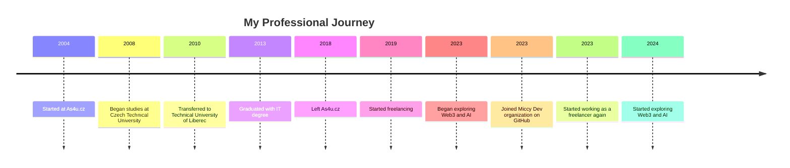
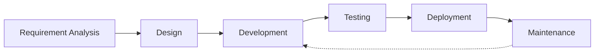

<div style="position: relative; padding: 30px 0; margin-bottom: 30px; text-align: center; max-width: 800px; margin: 0 auto;">
  
  <div style="position: absolute; top: 50%; left: 50%; transform: translate(-50%, -50%); width: 85%; text-align: center; background-color: rgba(0, 0, 0, 0.75); padding: 20px 30px; color: white; border-radius: 20px; z-index: 2;">
    <h1 style="margin: 0; font-size: 2.5em; color: white !important; text-shadow: 2px 2px 4px rgba(0, 0, 0, 0.5);">Miloš Macek</h1>
    <p style="margin-top: 10px; font-size: 1.2em; color: white !important; text-shadow: 1px 1px 2px rgba(0, 0, 0, 0.5);">Full Stack Developer | Mobile Apps | SaaS | AI | LLMs | Web3 | Blockchain</p>
  </div>
</div>

<div align="center" style="margin-top: 15px;">
  <a href="https://www.linkedin.com/in/miccy">
    
  </a>
  <a href="https://github.com/miccy">
    
  </a>
  <a href="mailto:info@miccy.dev">
    
  </a>
</div>

[🇬🇧 English version](docs/en/README.md)

## 📋 Obsah

- [🚀 O mně](#-o-mně)
- [🛠 Tech Stack](#-tech-stack)
  - [💻 Programovací jazyky](#-programovací-jazyky)
  - [📱 Mobilní vývoj](#-mobilní-vývoj)
  - [🌐 Frontend](#-frontend)
  - [🗄️ Backend & Databáze](#️-backend--databáze)
  - [🛠️ Vývojářské nástroje](#️-vývojářské-nástroje)
- [👨‍🎓 Vzdělání](#-vzdělání)
- [📚 Pracovní zkušenosti a projekty](#-pracovní-zkušenosti-a-projekty)
  - [💼 Freelancer (2019 - současnost)](#-freelancer-2019---současnost)
  - [💼 As4u.cz (2004 - 2018)](#-as4ucz-2004---2018)
- [🔭 Aktuální projekty](#-aktuální-projekty)
- [🔗 Aktuálně se zabývám](#-aktuálně-se-zabývám)
- [📫 Kontakty](#-kontakty)

## 🚀 O mně

Jsem nezávislý full-stack vývojář s patnáctiletou zkušeností. Dříve jsem se specializoval hlavně na vývoj mobilních aplikací, ale v současné době se zaměřuji hlavně na backend, SaaS, neopomíjím ani novinky ohledně webových aplikací, zkoumám možnosti integrace AI a trénování vlastních LLMs. Mým cílem je vytvářet robustní, uživatelsky přívětivá řešení, která propojují osvědčené postupy a nově vznikající technologie.

## 📊 GitHub Stats

<a href="https://github.com/miccy">
  
</a>
<a href="https://github.com/anuraghazra/convoychat">
  
</a>
<a href="https://github.com/anuraghazra/convoychat">
  
</a>

## 🛠 Tech Stack

### 💻 Programovací jazyky

<div align="center">
  


</div>

### 📱 Mobilní vývoj

<div align="center">


</div>

### 🌐 Frontend


### 🗄️ Backend & Databáze


### 🛠️ Vývojářské nástroje


## 🔄 Timeline



### Přidání sekce s projekty ve formě karet

## 🔥 Featured Projects

<div align="center">
  <a href="https://github.com/miccy-dev/as4u/mmvm">
    
  </a>
</div>

## 🔄 My Development Workflow



## 👨‍🎓 Vzdělání

### 🎓 2004 - 2008

**VOŠ a SPŠ Masarykova, Kutná Hora**
Obor Elektrotechnika - Sdělovací technika

### 🎓 2008 - 2010

**ČVUT, Fakulta elektrotechnická, Praha**
Obor Elektrotechnika

### 🎓 2010 - 2013

**Technická univerzita v Liberci**
Fakulta elektrotechniky a informatiky
Obor Informační technologie

## 📚 Pracovní zkušenosti a projekty

### 💼 Freelancer (2019 - současnost)

#### [SPUD Now](https://spudnow.co.uk/) - Construction Project Management Software | UK

- DownloDev
- březen 2023 - srpen 2024
- Stack: Expo, TypeScript, React Native

#### [Union](https://www.union.sk/union-zp-aplikacia-na-mobile) - zdravotní pojišťovna | SK

- [BOOTIQ, part of BiQ Group](https://www.bootiq.io)
- březen 2022 - říjen 2022
- Stack: TypeScript, GraphQL, React Native

#### [Mamio](https://www.mamio-app.com) - Těhotenská aplikace pro slovenský trh | SK

- [Eliaš IT Solutions](https://elias-itsolutions.sk)
- květen 2021 - prosinec 2022
- Stack: React Native, Expo

#### [Tlappka](https://www.tlappka.cz/) - Zdraví mazlíčků v kapse | CZ

- [Veevoy](https://veevoy.com)
- 2023
- Stack: React Native, Expo

#### [myPlann](https://www.sabservis.cz/myplann) - Zůstaňte navždy u klienta | CZ

- [SABService](https://www.sabservis.cz)
- 2022
- Stack: React Native, Expo

#### Keys of the Treasure - Geolokační hra | CZ

- [Sundisk](https://www.sundisk.cz/cs/)
- 2020
- Stack: React Native, Expo, Firebase

### 💼 As4u.cz (2004 - 2018)

- [As4u.cz, s.r.o.](https://www.as4u.cz/), Liberec (Vývojář mobilních aplikací)

#### Turnov v mobilu (2024 | last updated 2025)

- Oficiální aplikace města Turnov
- Expo, React Native, Supabase, Drizzle ORM

#### Praha 11 (2024 | last updated 2025)

- Oficiální aplikace města Praha 11
- Expo, React Native, Supabase, Drizzle ORM

#### Cestovatelský fotodeník (2023 | last updated 2024)

- Cestovatelská soutěžní hra
- Expo, React Native

#### Vrbno v mobilu (2023 | last updated 2024)

- Oficiální aplikace města Vrbno pod Pradědem
- React Native (Android / iOS)

#### Prostějov v mobilu (2023 | last updated 2024)

- Oficiální aplikace města Prostějov
- Expo, React Native

#### Jablonec v mobilu (2014 | last updated 2024)

- Oficiální aplikace města Jablonec nad Nisou
- Migrace z Ionic/Cordova na React Native a Expo

#### Litovel v mobilu (2016 | last updated 2024)

- Oficiální aplikace města Litovel
- React Native (Android / iOS)

#### Šumperk v mobilu (2023)

- Oficiální aplikace města Šumperk
- React Native a Expo (Android a iOS)

#### Jindřichův Hradec v mobilu (2015 | last updated 2023)

- Oficiální aplikace města
- Migrace z Cordova na React Native a Expo

#### Kuřim v mobilu (2014 | last updated 2023)

- Oficiální aplikace města Kuřim
- React Native a Expo (Android / iOS)

#### Poznej Hradec (2014 | last updated 2023)

- Poznávací a soutěžní hra města Jindřichův Hradec
- Každoroční aktualizace pro turistickou sezónu
- React Native (Android / iOS)

#### BITVA 1866 (2016 | last updated 2023)

- Mobilní aplikace pro muzeum východních Čech v Hradci Králové
- Vytvořeno k 150. výročí bitvy u Hradce Králové
- Android/iOS

#### Dny Evropského Dědictví (2022)

- Mobilní aplikace pro EHD
- Expo, React Native

#### Textilní a oděvní dílna (2016)

- Vzdělávací dětská hra pro Textilní muzeum Dvůr Králové
- Implementace pro tablety a informační kiosky
- Native Android (Java)

#### Kojetín v mobilu (2020)

- Oficiální aplikace města Kojetín
- Expo, React Native

#### Týniště nad Orlicí (2020)

- Oficiální aplikace města Týniště nad Orlicí
- Expo, React Native

#### Český ráj (2020)

- Oficiální turistický průvodce
- Expo, React Native

#### Český systém kvality služeb (2015)

- Oficiální aplikace ČSKS
- Vyhledávání a hodnocení certifikovaných subjektů
- Cordova (Android/iOS)

#### Mladoboleslavsko (2015)

- Oficiální turistický průvodce regionem
- Ionic/Cordova (Android/iOS)

#### Průvodce Libereckým krajem (2015)

- Oficiální turistický průvodce
- Ionic/Cordova (Android/iOS)

## 🔭 Aktuální projekty

### AS4U Mobile Solutions

Mobilní aplikace pro české obce

- 📱 MMVM - Nová verze ve vývoji
- 🏛️ Více městských variant
- Stack: Expo, React Native, TailwindCSS, Appwrite, MongoDB, TypeScript, React, Node.js

### Zvono Pawnshop

Kompletní business řešení

- 💼 Interní systém pro správu zákazníků
- 🌐 Firemní prezentační web
- 🚧 V aktivním vývoji
- Stack: Expo, Next.js, TailwindCSS, Supabase, PostgreSQL, TypeScript, React, Node.js

## 🔗 Aktuálně se zabývám

- [Prisma](https://www.prisma.io/) - ORM pro Next.js
- [thirdweb](https://github.com/thirdweb-dev/js) - Framework pro Web3 vývoj
- [DeepSeek](https://www.deepseek.com/) - Vlastní AI SaaS
- [Gaia Network](https://www.gaianetwork.io/)
- [zkSync](https://zksync.io/)

## 📫 Kontakty

- 🔗 LinkedIn: [@miccy](https://www.linkedin.com/in/miccy)
- 🔗 GitHub - Osobní: [@miccy](https://github.com/miccy)
- 🔗 GitHub - Organizace: [@miccy-dev](https://github.com/miccy-dev)
- 📧 Email - Info: [info@miccy.dev](mailto:info@miccy.dev)
- 📧 Email - Spolupráce: [jobs@miccy.dev](mailto:jobs@miccy.dev)

<div align="center">
<a href="https://app.daily.dev/miccy"></a>
</div>
```
